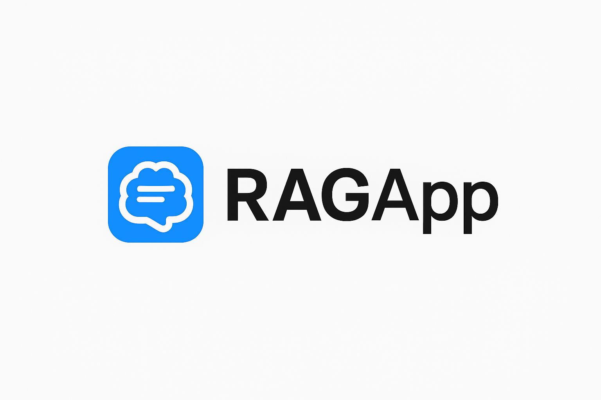
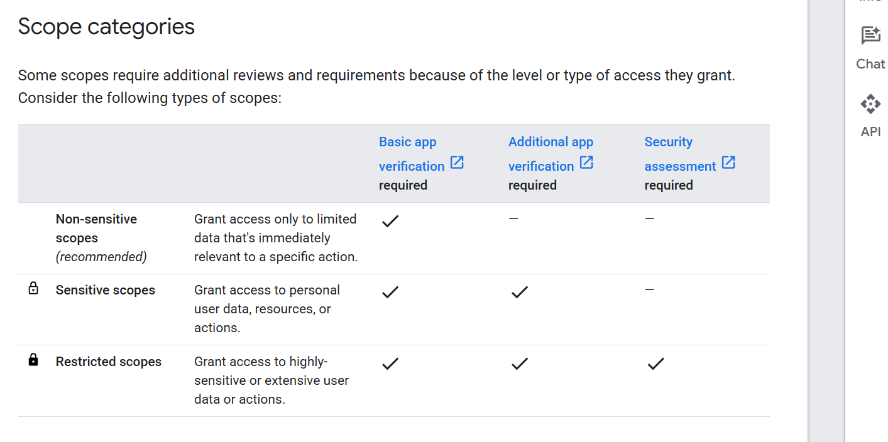

# AGENTIC AI RAG FOR GOOGLE DRIVE STORAGE


[](https://www.trychroma.com)

---


# APP connections to GOOGLE CLOUD PLATFORM and others for app needs
For just this project we need to connect GCP and to be able to edit credentials, enable/disable APIs
We need also create all the best rights and secured data access for our users.


# About App and Users data
## Create a project and join a service account to with editor role
## Enable Google DRIVE API
L'API Drive nécessite des autorisations dans la console Google Cloud et lorsque vous lancez l'API dans votre code.
Dans la console Google Cloud, vous devez déclarer les autorisations dont votre application a besoin dans la configuration de son écran de consentement OAuth. Il s'agit du niveau d'autorisation le plus élevé que votre application puisse demander. Il s'agit d'une demande formelle adressée à Google. Les niveaux d'accès déclarés sont ceux que Google affiche aux utilisateurs sur l'écran de consentement. Il permet à l'utilisateur de comprendre exactement à quelles données et actions votre application demande l'accès. Pour en savoir plus, [consultez Configurer l'écran de consentement OAuth et choisir des habilitations](https://developers.google.com/workspace/guides/configure-oauth-consent?hl=fr).
# Create OAuth2 for client ID and Client Secret that will allow users authentication to App.

OAuth2 is used for apps that have to access to user data like Google Drive file, or even insert data to google sheet database.

## How OAuth2 operates ?


This how users connect to your Google Drive App.

At first set up Google Auth Platform


**Rappel**:

Pour l'application :

1- Lire les fichiers Drive de l’utilisateur

2- Créer des chunks et embeddings (côté app)

3- Stocker ces embeddings dans une base vectorielle (côté app, pas dans Drive)

4- Pas de création, modification ou suppression de fichiers dans Drive.


Les scopes dont j'aurai probablement besoin:

🔎 Analyse des scopes

Scopes|roles
--|--
https://www.googleapis.com/auth/drive.readonly | ✅ Tu pourras lire tout le contenu des fichiers Drive (donc ouvrir et traiter les fichiers).
https://www.googleapis.com/auth/drive | Accès complet (lecture/écriture/suppression) 🚫 Trop large pour ton besoin, et surtout ça déclenchera une vérification de sécurité obligatoire chez Google si tu veux ouvrir ton app à des utilisateurs externes.


Il faut les définir à la fois côté Google console  et coté Application


Déclaration des scopes

Google Console | Google APP (ici mon app qui se connecte à google)
-|-
(afficher sur la page de consentement) | (Quand tu lances ton script, l’utilisateur est redirigé vers la page d’autorisation. Cette page affiche les scopes que tu as demandés → Google compare avec ceux déclarés dans la console.). Si ça correspond, l’utilisateur peut accepter → ton app reçoit un token d’accès avec exactement ce scope.


✅ En résumé :

Console Google : déclaration officielle des scopes que ton app utilisera (pour l’écran de consentement).

Code Python : scopes que tu demandes réellement quand tu crées le **flux OAuth**.

Les deux doivent matcher.


**Définition des scopes dans Google Console**


****
[Basic app verification required](https://support.google.com/cloud/answer/13463073?visit_id=638942145643558756-1868041267&hl=fr&rd=1&dark=1&sjid=10812633968201329191-EU#ver-prep&zippy=%2Csteps-to-prepare-for-verification)


**Centre de validation**

Google, pour cette app, doit vérifier l'accès aux données.(but est de vérifier si l'app)

🏁 Comment se présente la validation

Si tu cliques sur “Demander une validation”, Google te lance dans un process qui ressemble à ça :

1. Informations obligatoires :

URL de politique de confidentialité (même un site simple type GitHub Pages ou Notion).

Nom et logo de ton application.

Adresse e-mail de contact.

2. Preuves d’usage du scope sensible :

Tu dois expliquer pourquoi tu as besoin du scope drive.readonly.

Démontrer que tu n’utilises pas les données à mauvais escient.

3. Vidéo de démo :

Tu dois tourner une vidéo qui montre comment l’utilisateur interagit avec ton app, comment il autorise l’accès, et ce que ton app fait avec les fichiers.

4. Revue Google :

Ils vérifient que ton app correspond bien à la description.

Ils peuvent demander des précisions.

Délai : quelques jours à quelques semaines selon la complexité.

[Pour plus d'informations](https://support.google.com/cloud/answer/15549049?hl=fr&visit_id=638942145644745956-18931629&rd=1#verification-status&zippy=%2Capp-name) ...


# Install the project
Be aware that all things explained above are a MUST.

```
git clone https://github.com/donat-konan33/GoogleDriveAgenticIARag.git
cd GoogleDriveAgenticIARag
```

# About project, tools, prompts, Database and RAG Pipeline used


Chroma is the open-source AI application database. Chroma makes it easy to build LLM apps by making knowledge, facts, and skills pluggable for LLMs.

According to the above operating figure, ``chroma db`` can rephrase the query emitted by users.

Chroma gives you everything you need for retrieval:

- Store embeddings and their metadata
- Vector search
- Full-text search
- Document storage
- Metadata filtering
- Multi-modal retrieval


🔹 ***Comprendre la recherche vectorielle***

Il s'agit de créer espace vectorielle des données et de comparer leur similarité à celle d'un vecteur correspondant à une requête (Example: la question à un chatbot est transformée en vecteur via la technique d'embeddings)


1. **Documents → Chunks**

- Un document est découpé en petits morceaux (chunks), souvent des phrases, paragraphes ou segments.

- Chaque chunk contient un texte limité pour être traité par un modèle d’embedding.

2. **Chunks → vecteurs**

- Chaque chunk est transformé en vecteur numérique à l’aide d’un modèle d’embeddings (ex : OpenAI, SentenceTransformers).

- Le vecteur capture le sens sémantique du texte, pas juste les mots exacts.

3. **Vecteurs → espace vectoriel**

- Tous les vecteurs sont placés dans un espace vectoriel multidimensionnel (souvent 512 à 1536 dimensions selon le modèle).

- Chaque vecteur représente un chunk et sa position reflète sa similarité avec les autres :

    - Vecteurs proches → chunks similaires.

    - Vecteurs éloignés → chunks différents.

4. **Recherche vectorielle**

- Quand on fait une requête, elle est aussi transformée en vecteur.

- On calcule la distance ou similarité entre ce vecteur de requête et les vecteurs des chunks.

- Les chunks les plus proches dans l’espace vectoriel sont retournés comme résultats pertinents.

🔹 **Points clés**

- Les chunks permettent de gérer les documents volumineux et d’avoir des résultats précis.
- L’espace vectoriel est la base de la recherche sémantique : il permet de retrouver du contenu similaire même si les mots exacts ne sont pas utilisés.
- L’approche est utilisée dans des systèmes comme ChatGPT retrieval-augmented generation (RAG), moteurs de - recherche intelligents, et assistants documentaires.


```
                                    Document source
                                           │
                                           ▼
                                    Découpage en chunks
                                           │
                                           ▼
                                    Vecteurs d’embeddings
                                           │
                                           ▼
                                    Index vectoriel (Chromadb, FAISS, Milvus…)
                                           │
                                           ▼
                                    Requête utilisateur
                                           │
                                           ▼
                                    Vecteur de la requête (lié à la requête du client)
                                           │
                                           ▼
                                    Recherche des vecteurs proches ()
                                           │
                                           ▼
                                    Chunks pertinents → Résultats ou RAG
```


## Principes et étapes clés de la vectorisation


1. **Texte brut**

Commence avec ton texte ou ton chunk de document :

"Bonjour, ceci est un exemple de texte."


2. **Tokenisation**

- Transformer le texte en tokens (unités de base que le modèle comprend).
- Exemple : "Bonjour, ceci est un exemple" → ["Bonjour", ",", "ceci", "est", "un", "exemple"]
- Ajout de tokens spéciaux selon le modèle ([CLS], [SEP], padding).
- AutoTokenizer est pratique : il détecte automatiquement le tokenizer correspondant au modèle choisi.

3. **Encodage en tenseurs**

- Les tokens sont convertis en IDs numériques et en tenseurs PyTorch ou TensorFlow.
- Padding/truncation pour que tous les chunks aient la même longueur si nécessaire.

4. **Passage dans le modèle**

- Le modèle transforme les tokens en représentations vectorielles (embeddings).
- Parfois, on récupère :
    -     last_hidden_state → vecteurs pour chaque token
    -     pooler_output ou moyenne → vecteur global du texte

5. **Post-traitement (optionnel)**

- Moyenne des vecteurs token pour obtenir embedding global du chunk.
- Normalisation (ex. L2 normalization) si on veut calculer cosine similarity.

6. **Indexation**

- Stocker l’embedding dans un index vectoriel (FAISS, Milvus, Pinecone…).
- Chaque vecteur est lié à son chunk/document d’origine.

**Rôle de AutoTokenizer**

AutoTokenizer est toujours pertinent si :
- Tu veux charger un modèle Hugging Face sans te soucier du tokenizer exact (BERT, MPNet, etc.).
- Il choisit automatiquement le tokenizer compatible avec ton modèle (vocabulaire, tokens spéciaux, normalisation).

**Alternative** : tu peux instancier directement un tokenizer spécifique (MPNetTokenizer) si tu veux un contrôle fin, mais pour la plupart des cas AutoTokenizer suffit et simplifie le code.

```
                                        Texte brut
                                            │
                                            ▼
                                        Tokenisation (AutoTokenizer)
                                            │
                                            ▼
                                        Conversion en tenseurs
                                            │
                                            ▼
                                        Modèle (AutoModel / SentenceTransformer)
                                            │
                                            ▼
                                        Vecteur (embedding du chunk)
                                            │
                                            ▼
                                        Index vectoriel / recherche vectorielle
```


## Vector Database Chroma
Vector databases provide essential production capabilities:

- Persistent storage: Data survives system restarts and crashes
- Optimized indexing: Fast similarity search using HNSW algorithms
- Memory efficiency: Handles millions of vectors without RAM exhaustion
- Concurrent access: Multiple users query simultaneously
- Metadata filtering: Search by document properties and attributes
[ChromaDB](https://github.com/chroma-core/chroma) delivers these features with a Python-native API that integrates seamlessly into your existing data pipeline.

## Choice of the best Open-source llm fro our project
I choose according to for relevant factors such as :
- Open-Source version
- Usage Type (Rag, QA, chatbot)
- generation and text understanding
- translator, summarizer

We can OpenLLM API to execute a model from whether local or remote server. Once install there are all OpenAI-BAsed models that can be used.

Our project is created to be used by french. So Mistral 7B quantified could be the best choice for our application based on its main goal.

For more details hit this [link](https://python.langchain.com/docs/integrations/llms/openllm/) leading you forward the langchain page talking about that.

| Critère             | Chatbot 🤖                    | QA 🔍                                 |
| ------------------- | ----------------------------- | ------------------------------------- |
| **But**             | Dialogue naturel              | Réponse factuelle                     |
| **Contexte**        | Historique de la conversation | Base documentaire externe             |
| **Fiabilité**       | Peut halluciner               | Plus fiable (car fondé sur documents) |
| **Exemple d’usage** | Assistant client, discussion  | Recherche juridique, scientifique     |

## Langchain Components
[Chat models](https://python.langchain.com/docs/integrations/chat/)
[Retrievers](https://python.langchain.com/docs/integrations/retrievers/)
[Tools/Toolkits](https://python.langchain.com/docs/integrations/tools/)
[Document loaders webpages - crawl](https://python.langchain.com/api_reference/community/document_loaders/langchain_community.document_loaders.firecrawl.FireCrawlLoader.html)
[Document loaders webpages - web](https://python.langchain.com/docs/integrations/document_loaders/web_base/)

[Vector stores](https://python.langchain.com/docs/integrations/vectorstores/)
[Embedding models](https://python.langchain.com/docs/integrations/text_embedding/)
[Gemini embeddings model](https://ai.google.dev/gemini-api/docs/embeddings)
[model caches](https://python.langchain.com/docs/integrations/llm_caching/)

Chat Loaders : Telegram, WhatsApp, WeChat, Slack, twitter(via Apify), LangSmith Chat Datasets, LangSmith LLM Runs

**LangSmith**
🎯 Ce que fait LangSmith

- Débogage et traçage : tu peux voir tout le déroulé d’une requête (prompts, réponses, appels API, embeddings, agents, outils utilisés).
- Évaluation : comparer différentes versions de prompts ou modèles avec des métriques quantitatives/qualitatives.
- Monitoring : suivre les performances, la latence, les erreurs, les coûts d’API, etc.
- Collaboration : partager des runs et workflows avec ton équipe.
- C’est donc plutôt un équivalent de “DataDog” ou “Sentry”, mais pour les applications LLM.

https://python.langchain.com/docs/integrations/retrievers/

## [Usage of hosted gpu on GCP or other providers](https://python.langchain.com/docs/integrations/text_embedding/self-hosted/)

Turn your APP on locally and leverage the power of gpu hosted by providers.


## Providers and different possibilities

[Google](https://python.langchain.com/docs/integrations/providers/google/)
[Google VectorSearch](https://python.langchain.com/docs/integrations/vectorstores/google_vertex_ai_vector_search/)
[HuggingFace](https://python.langchain.com/docs/integrations/providers/huggingface/)
[Mistral](https://python.langchain.com/docs/integrations/providers/mistralai/)

[Mistral embeddings](https://docs.mistral.ai/capabilities/embeddings/text_embeddings/) for clustering, retrieval

## There are embeddings models and chat models
### Providers solutions
Understanding embeddings GenAI model and others models ????

```
from google import genai

client = genai.Client()

result = client.models.embed_content(
        model="gemini-embedding-001",
        contents="What is the meaning of life?")

print(result.embeddings)
```

**[Some Use Cases](https://python.langchain.com/docs/integrations/chat/google_vertex_ai_palm/)**
-----

Supported task types
Task type	Description	Examples
SEMANTIC_SIMILARITY	Embeddings optimized to assess text similarity.	Recommendation systems, duplicate detection
CLASSIFICATION	Embeddings optimized to classify texts according to preset labels.	Sentiment analysis, spam detection
CLUSTERING	Embeddings optimized to cluster texts based on their similarities.	Document organization, market research, anomaly detection
RETRIEVAL_DOCUMENT	Embeddings optimized for document search.	Indexing articles, books, or web pages for search.
RETRIEVAL_QUERY	Embeddings optimized for general search queries. Use RETRIEVAL_QUERY for queries; RETRIEVAL_DOCUMENT for documents to be retrieved.	Custom search
CODE_RETRIEVAL_QUERY	Embeddings optimized for retrieval of code blocks based on natural language queries. Use CODE_RETRIEVAL_QUERY for queries; RETRIEVAL_DOCUMENT for code blocks to be retrieved.	Code suggestions and search
QUESTION_ANSWERING	Embeddings for questions in a question-answering system, optimized for finding documents that answer the question. Use QUESTION_ANSWERING for questions; RETRIEVAL_DOCUMENT for documents to be retrieved.	Chatbox
FACT_VERIFICATION	Embeddings for statements that need to be verified, optimized for retrieving documents that contain evidence supporting or refuting the statement. Use FACT_VERIFICATION for the target text; RETRIEVAL_DOCUMENT for documents to be retrieved	Automated fact-ch
****


[**Antropic model usages**](https://pypi.org/project/langchain-anthropic/)

[Understanding anthropic model integrations](https://python.langchain.com/docs/integrations/chat/anthropic/)

**Chat Models**
```
from langchain_anthropic import ChatAnthropic
from langchain_core.messages import AIMessage, HumanMessage

model = ChatAnthropic(model="claude-3-opus-20240229", temperature=0, max_tokens=1024)
message = HumanMessage(content="What is the capital of France?")
```
Autre modèle de chat:
-
Others ChatVertexAI


**LLMs**
```
from langchain_anthropic import AnthropicLLM

model = AnthropicLLM(model="claude-2.1", temperature=0, max_tokens=1024)
response = model.invoke("The best restaurant in San Francisco is: ")
```

La “température” : à quoi ça sert ?

La température dans les modèles de langage est un hyperparamètre qui contrôle le degré de “randomness” / diversité / créativité dans la génération du texte.
où
𝑇
T est la température.

Si
𝑇
=
1
T=1, on utilise les probabilités “telles quelles”.

Si
𝑇
<
1
T<1 (ex : 0.2, 0.3), on “étire” les différences : les probabilités élevées deviennent encore plus élevées, les faibles deviennent plus faibles → le modèle est plus déterministe (il va souvent choisir les mots les plus probables).

Si
𝑇
>
1
T>1, on “aplatit” les différences : cela donne plus de chance aux mots moins probables d’être choisis → sorties plus « créatives », moins prévisibles.

Effets pratiques

Température basse (ex : 0.0 à 0.3 / 0.5) : idéal pour des tâches où tu veux de la cohérence, de la précision, moins de “dérives” (ex : réponses factuelles, résumé, QA).

Température plus élevée (ex : 0.7, 1.0, voire >1) : utile si tu veux de la diversité, de la créativité (écriture, dialogues, brainstorming).

Une température trop élevée peut rendre le texte incohérent ou erratique.

## Global Overview
[See an overview topic around LLM](https://docs.mistral.ai/guides/observability/#model)

## Mistral: all available [models](https://docs.mistral.ai/getting-started/models/models_overview/)

**[Google Search](https://ai.google.dev/gemini-api/docs/live) Use case as built-in tools**

```

# Gemini can execute a Google search and use the results to ground its responses:

from langchain_google_vertexai import ChatVertexAI

llm = ChatVertexAI(model="gemini-2.5-flash").bind_tools([{"google_search": {}}])

response = llm.invoke("What is today's news?")
```

or

**[Code execution]()**

```
from langchain_google_vertexai import ChatVertexAI

llm = ChatVertexAI(model="gemini-2.5-flash").bind_tools([{"code_execution": {}}])

response = llm.invoke("What is 3^3?")
```
An other Useful resource for [grounding with google search](https://ai.google.dev/gemini-api/docs/google-search).

## **Prompt caching**

## Message Histories

## [LangSmith](https://docs.langchain.com/langsmith/home) for tracking langchain workflow : Monitor and evaluate LLM App

## LangGraph : Build effective Agentic System

## [Langchain Agent](https://python.langchain.com/docs/integrations/tools/gradio_tools/#related)

## [LangChain on GCP cloud](https://cloud.google.com/use-cases/langchain?hl=fr)

## Frontend : Gradio and streamlit

[**Streamlit**](https://python.langchain.com/docs/integrations/memory/streamlit_chat_message_history/)

[**Gradio**](https://python.langchain.com/docs/integrations/tools/gradio_tools/#related)

### Utilisation de solution en local
LM Studio se concentre sur la facilité d’usage, OpenLLM sur la flexibilité (déploiement, MLOps, etc.).

---
Thanks to Khuyen Tran
