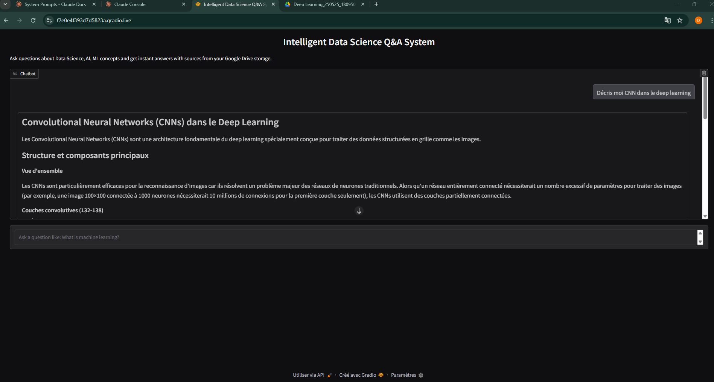

# **AGENTIC AI RAG FOR GOOGLE DRIVE STORAGE**


[](https://www.trychroma.com)

---


# Google Drive RAG Chatbot

## 📌 **Overview**

This application enables secure, read-only Retrieval-Augmented Generation (RAG) over a user’s Google Drive documents using open-source LLMs and vector search.
It extracts, chunks, embeds, and indexes documents into ChromaDB, then answers user queries with grounded, context-aware responses — without modifying or storing user files.

✅ Only read access is requested (`drive.readonly`).
🔒 No file creation, modification, or deletion.
🌍 Designed for French-speaking users with LLM providers like Antropic or Mistral support.

---

## 🔧 Key Components

| Layer               | Technology |
|--------------------|------------|
| Auth & Data Access  | Google OAuth2 + `drive.readonly` |
| Document Loader     | LangChain Google Drive Loader |
| Embedding Model     | Sentence Transformers / Mistral Embeddings |
| Vector DB           | Chroma (local or cloud) |
| LLM                 | Claude Sonnet 3.7 and Mistral 7B (quantized, via OpenLLM or local inference) |
| Orchestration       | LangChain + LangGraph |
| Frontend            | Gradio
| Observability       | LangSmith (this option is not a free service)|

---

## ⚙️ Setup & Configuration

### 1. Google Cloud Platform Setup
1. Create a Google Cloud Project.
2. Enable the Google Drive API.
3. Configure the OAuth Consent Screen:
   - User Type: External (for testing) or Internal (Workspace only)
   - Add your email as a Test User
   - Declare the OAuth scope: `https://www.googleapis.com/auth/drive.readonly`
4. Create OAuth 2.0 Client ID → download `credentials.json`.
📝 **Important:** For public deployment, Google verification is required for sensitive scopes.

### 2. Local Installation
```bash
git clone https://github.com/donat-konan33/GoogleDriveAgenticIARag.git
cd GoogleDriveAgenticIARag
poetry install
```

Place your ``credentials.json`` in the ``root`` or ``src/`` directory.

---


### 3. Run the Pipeline

```
# Step 1: Ingest & index Google Drive documents
poetry run python -m src.googledriveagenticiarag.rag_pipeline

# Step 2: Launch the chat interface
poetry run python -m src.googledriveagenticiarag.main

```
**The app will**:

- Prompt for Google OAuth authentication.
- Fetch and chunk your Drive files.
- Generate embeddings and store them in ChromaDB.
- Launch a Gradio/Streamlit UI for querying.

[](https://donat-konan33.github.io/assets/videos/demo-rag.mp4)


## 🔐 Security & Compliance

- Minimal scope: Only drive.readonly is used.
- No data retention: Files are processed in-memory; only embeddings & metadata are stored locally.
- User consent: Explicit OAuth approval required.
- Private by default: Runs locally unless deployed to GCP.

## Deployment Options

| Environment  | Notes                                               |
| ------------ | --------------------------------------------------- |
| Local (Dev)  | Uses local GPU/CPU via OpenLLM or LM Studio         |
| GCP (Prod)   | Deploy with Vertex AI, Cloud Run, or Compute Engine |
| ChromaDB Cloud | Optional managed vector DB (SOC 2 compliant)        |


---
---

**Credits**: **Inspired by [@khuyentran1401](https://github.com/khuyentran1401)'s RAG pipeline tutorial (CodeCut AI)**.
